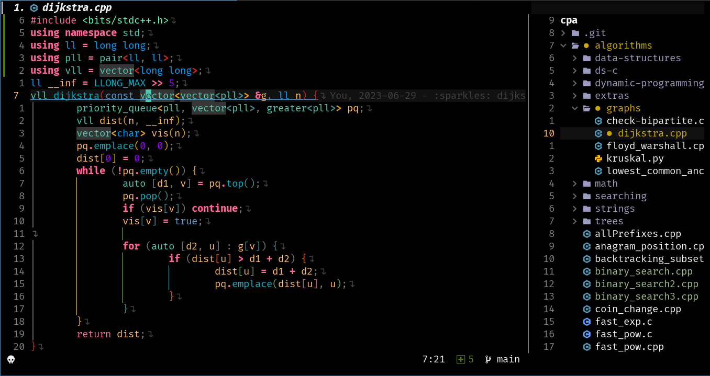
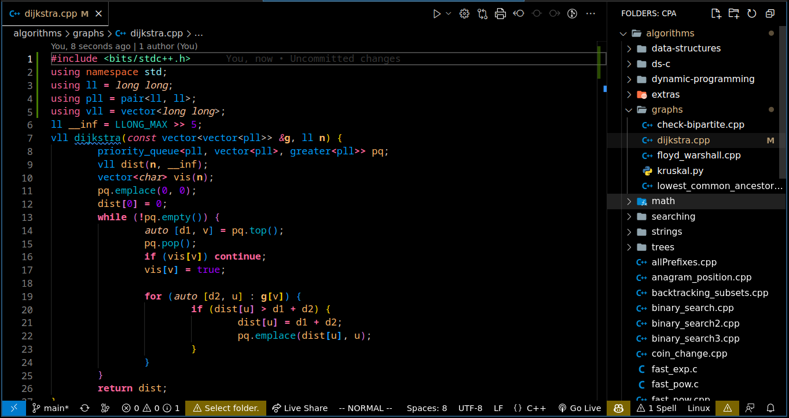

# Noctis high contrast

__🚧 Still under development, so there is some details missing 🚧__




A beautiful high contrast theme for your neovim written in lua.

This theme is originally from the [noctis high contrast from vscode](https://github.com/KamenKolev/noctis-hc), including the colors for code and plugins similar to those in vscode. It was built over the [darkplus.nvim](https://github.com/LunarVim/darkplus.nvim), which has most of the highlight used in vscode, so may some colors are not set yet.

## Supported plugins

- [Telescope]()
- [NvimTree]()
- [Lualine]()
- [GitSigns]()

## Install

- Lazy:

  ```lua
  local plugins = {
      {"iagorrr/noctishc.nvim"}
  }

  local opts = {}

  require("lazy").setup(plugins. opts)
  ```

## Useful & Related Topics

1. [djanho](https://github.com/viniciusmuller/djanho) an amazing tool to convert vscode themes to (Neo)vim themes.
2. [Noctis High contrast from vscode](https://github.com/KamenKolev/noctis-hc)
