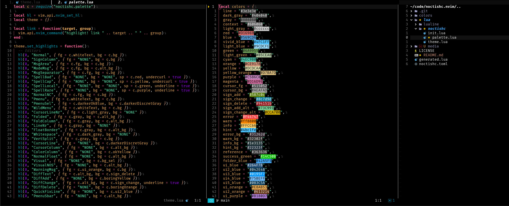

# Noctis high contrast



The best high contrast theme for neovim.

This theme is mostly based in the [noctis-hc](https://github.com/KamenKolev/noctis-hc).

## Supported plugins

- [Telescope](https://github.com/nvim-telescope/telescope.nvim)
- [NvimTree](https://github.com/nvim-tree/nvim-tree.lua)
- [Lualine](https://github.com/nvim-lualine/lualine.nvim)
- [GitSigns](https://github.com/lewis6991/gitsigns.nvim)

## Installation

- Lazy:

  ```lua
  local plugins = {
      {"iagorrr/noctishc.nvim"}
  }

  local opts = {}

  require("lazy").setup(plugins. opts)
  ```

## Useful & Related Topics

1. [djanho](https://github.com/viniciusmuller/djanho) an amazing tool to convert vscode themes to (Neo)vim themes.
2. [Noctis High contrast from vscode](https://github.com/KamenKolev/noctis-hc)
